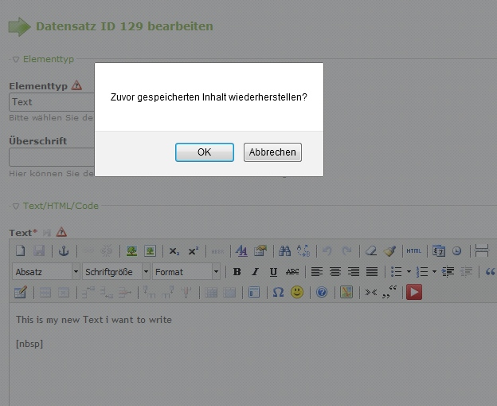

Contao Extension: TinyMceLocalStorage
=====================================

Special TinyMCE plugin for temporarily storing texts in the local storage of the browser and restoring them (e.g. after unnoticed logout, when session timed out).

Special thanks to Lingo4you aka @Babelfisch for the javascript code.

Installation
------------

The extension is not published in contao extension repository.
Install it manually or via [composer](https://packagist.org/packages/cliffparnitzky/tiny-mce-local-storage).

Tracker
-------

https://github.com/cliffparnitzky/TinyMceLocalStorage/issues

Compatibility
-------------

- min. version: Contao 3.0.x
- max. version: Contao 3.2.x

Dependency
----------

- To load this plugin and add it to the configuration the extension [[TinyMcePluginLoader]](https://github.com/cliffparnitzky/TinyMcePluginLoader) has to be installed.

Screenshot
----------

